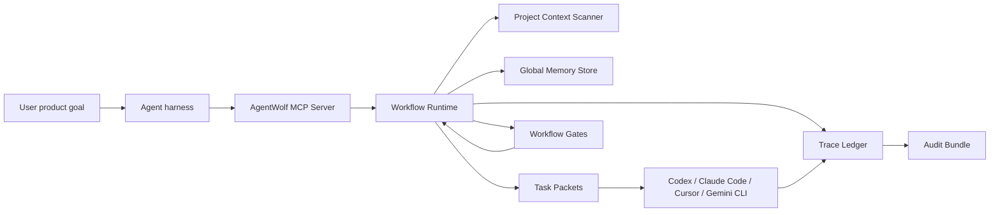

# Architecture

AgentWolf is a workflow kernel around external coding agents. Codex, Claude Code, Cursor, Gemini CLI, or another execution model can do the code work; this project owns the engineering process around that work.

## Component Map



## Core Principles

- The user provides the product goal.
- The workflow runtime plans, records, asks, gates, and dispatches.
- Execution agents implement, verify, review, or document delegated role tasks.
- Adapters execute tasks but do not own workflow decisions.
- Global memory is cross-project and evidence-backed.
- Project logs are append-oriented and inspectable.
- Gates require evidence rather than claims.

## Main Components

### MCP Server

The MCP server is the primary entrypoint. It exposes tools such as `advance_workflow`, `get_role_action`, `dispatch_agent_task`, `record_changeset`, `record_evidence`, and `export_audit_bundle`.

The server is implemented directly over stdio JSON-RPC to keep the runtime portable and dependency-light.

### Workflow Runtime

The runtime is the state machine that advances a product goal through:

```text
intake -> context_scan -> experience_retrieval -> clarification_gate -> requirements
-> architecture -> planning -> build_loop -> verification_loop -> review_gate
-> release_readiness -> retro_learn -> archive
```

It stops when it reaches:

- a high-impact user decision
- an external agent task
- a failed gate
- a genuine blocker
- a completed archive

### Global Memory Store

Global memory lives outside a single project. It stores principles, playbooks, anti-patterns, cases, rules, role checklists, stack knowledge, and organization preferences.

Learning proposals must include evidence references. This prevents the system from writing generic lessons without proof.

### Trace Ledger

The trace ledger is append-oriented. It records workflow events, artifacts, decisions, evidence, ChangeSets, gates, dispatch packets, progress messages, and audit exports.

The trace model supports:

```text
requirement -> design -> task -> code -> tests -> review -> release
file change -> requirement -> decision -> agent -> evidence -> rollback
```

### Agent Adapters

Adapters are intentionally thin. Today, the runtime generates task packets for agents such as Codex or Claude Code. A future adapter can supervise processes more deeply, but it should still treat the workflow runtime as the owner of process decisions.

## Trust Boundaries

| Boundary | Rule |
| --- | --- |
| User goal | Must be provided by the user, not invented by the runtime. |
| Repository facts | Must be scanned before asking avoidable questions. |
| High-impact uncertainty | Must become a recorded user decision. |
| Code modifications | Must become ChangeSets with rollback plans. |
| Tests and scans | Must become evidence records. |
| Learning | Must be backed by evidence references. |
| Release | Must have audit and rollback context. |
